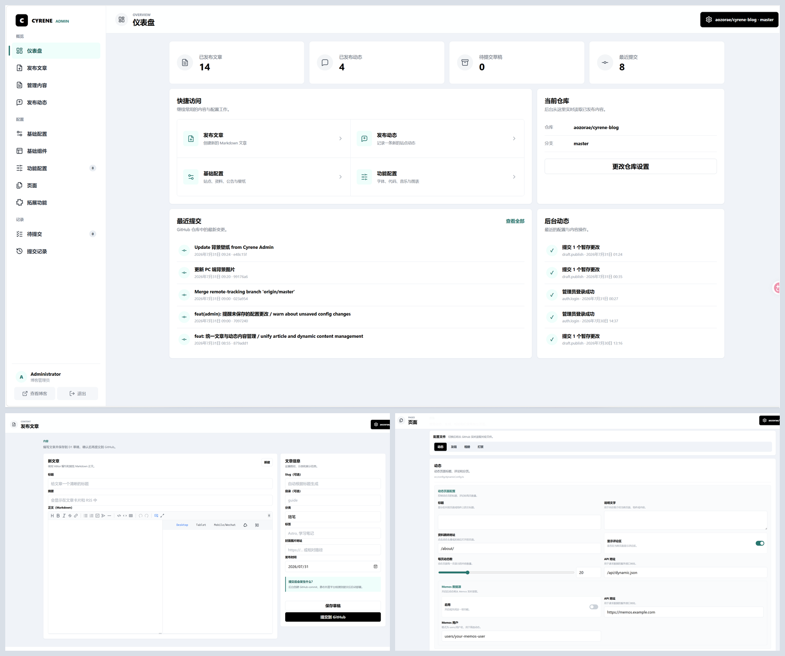

<div align="center">

# 昔涟 / Cyrene
> 一款基于 Astro 与 Firefly 深度定制，并配有独立可视化后台的个人博客
> 
>  


>
> [](https://github.com/aozorae/cyrene-blog/stargazers)
[](https://github.com/aozorae/cyrene-blog/network/members)
[](https://github.com/aozorae/cyrene-blog/issues)
> 
> 

</div>

---

📖 README：
**[简体中文](README.md)** | **[繁體中文](docs/README.zh-TW.md)** | **[English](README.en.md)** | **[日本語](docs/README.ja.md)** 

🚀 快速指南：
[**🖥️ 在线预览**](https://cyrene-blog.vercel.app/) /
[**📝 使用文档**](https://github.com/aozorae/cyrene-docs) /
[**📦 项目仓库**](https://github.com/aozorae/cyrene-blog)

⚡ 静态站点生成: 基于 Astro 的超快加载速度和 SEO 优化

🎨 奶油樱花粉: 在 Firefly 原有布局上调整为更柔和、清爽的个人化配色

📱 移动友好: 完美的响应式体验，移动端专项优化

🧭 可视化后台: 不需要手动改配置文件，也能发布内容、管理草稿和调整站点

>[!TIP]
>
>Cyrene 是在 [Firefly](https://github.com/CuteLeaf/Firefly) 基础上继续定制的 Astro 个人博客。前端保留了 Firefly 丰富的页面、布局与 Markdown 能力，并调整为奶油樱花粉配色；同时新增独立的 Cloudflare Workers 管理后台，让不熟悉 Git、Markdown 和 TypeScript 的用户也能通过图形界面维护博客。
>
>博客前端与管理后台相互独立。即使后台暂时不可用，已经部署的静态博客仍可正常访问。
>
>GitHub 仓库仍是已发布文章、动态和配置的唯一真实来源；D1 只保存后台设置、草稿、登录限流和审计记录。
>
>**更多使用说明请查看：[Cyrene 配置文档](https://github.com/aozorae/cyrene-docs)。**

## 🧭 图形化管理后台

Cyrene 的重点不只是博客前台，还包括一套面向日常使用的独立管理后台。登录后即可连接目标 GitHub 仓库与分支，通过侧栏完成内容发布、配置修改、草稿管理和提交记录查看，尽量把原本需要改代码、写 Frontmatter 和执行 Git 命令的工作变成表单操作。

### 内容发布与管理

- [x] **后台仪表盘** - 汇总文章、动态、草稿和提交数量，并展示最近提交与审计记录
- [x] **文章发布** - 使用自托管 Vditor Markdown 编辑器，支持工具栏、桌面分屏预览、移动端单栏编辑、字数统计、正文回填和必填校验
- [x] **完整文章字段** - 可填写标题、描述、Slug、目录、分类、标签、封面图和发布日期
- [x] **动态发布** - 在后台编辑动态正文与发布时间，自动生成规范文件名和 Frontmatter
- [x] **已发布文章管理** - 实时读取 GitHub 内容，支持查看、编辑和删除 Markdown 文章；MDX 内容保留源码查看入口
- [x] **草稿与待提交** - 文章、动态和配置都可先保存到 D1，之后统一检查、编辑、删除或批量提交
- [x] **冲突保护** - 提交前对比 GitHub 文件版本，发现外部修改时提示冲突，避免静默覆盖线上内容
- [x] **提交与审计记录** - 查看 GitHub 提交记录和后台操作记录，便于追踪每次改动



<p align="center"><strong>上方：仪表盘</strong> · <strong>左下：文章编辑器</strong> · <strong>右下：页面管理</strong></p>

### 发布方式

```text
后台表单操作 -> 保存 D1 草稿 -> 提交到 GitHub -> Vercel 自动构建博客
```

管理后台位于 `admin/`，作为独立 Cloudflare Worker 部署。它使用 GitHub Token 提交内容，但不会成为博客前端的运行时依赖；敏感信息通过 GitHub Secrets 和 Wrangler Secrets 注入，不写入源码。

## ✨ 功能特性

### 前端核心功能

- [x] **Astro + Tailwind CSS** - 基于现代技术栈的超快静态站点生成
- [x] **流畅动画** - Swup 页面过渡动画，提供丝滑的浏览体验
- [x] **响应式设计** - 完美适配桌面端、平板和移动设备
- [x] **多语言支持** - i18n 国际化，UI 支持简体中文、繁体中文、英文、日文、俄语、韩文
- [x] **全文搜索** - 基于 Pagefind 的客户端搜索，支持文章内容索引
- [x] **奶油樱花粉配色** - 在原有布局基础上调整主题色、文字与组件视觉

### 个性化
- [x] **动态侧边栏** - 支持配置单侧边栏、双侧边栏
- [x] **文章布局** - 支持配置(单列)列表、网格(多列/瀑布流)布局
- [x] **字体管理** - 支持自定义字体，丰富的字体选择器
- [x] **页脚配置** - HTML 内容注入，完全自定义
- [x] **亮暗色模式** - 支持亮色/暗色/跟随系统三种模式
- [x] **导航栏自定义** - Logo、标题、链接全面自定义
- [x] **壁纸模式切换** - 横幅壁纸、全屏壁纸、全屏透明壁纸、纯色背景
- [x] **主题色自定义** - 360° 色相调节

如果你有好用的功能和优化，请提交 [Pull Request](https://github.com/aozorae/cyrene-blog/pulls)

## 🚀 快速开始

### 环境要求

- Node.js ≥ 22
- pnpm ≥ 9

### 本地开发部署

1. **克隆仓库：**
   ```bash
   git clone https://github.com/aozorae/cyrene-blog.git
   cd cyrene-blog
   ```
   
   **也可以先 [Fork](https://github.com/aozorae/cyrene-blog/fork) 到自己的仓库再克隆。**

   ```bash
   git clone https://github.com/your-github-name/cyrene-blog.git
   cd cyrene-blog
   ```
2. **安装依赖：**
   ```bash
   # 如果没有安装 pnpm，先安装
   npm install -g pnpm
   
   # 安装项目依赖
   pnpm install
   ```

3. **配置博客：**
   - 编辑 `src/config/` 目录下的配置文件自定义博客设置

4. **启动开发服务器：**
   ```bash
   pnpm dev
   ```
   博客将在 `http://localhost:4321` 可用
   
### 社区教程
Cloudflare Workers 部署：[【不用服务器，无需备案，零成本搭建一个自己的个人博客】](https://www.bilibili.com/video/BV1hX9XBKEhm)

### 平台托管部署
- **参考[官方指南](https://docs.astro.build/zh-cn/guides/deploy/)将博客部署至 Vercel, Netlify, Cloudflare Pages, EdgeOne Pages 等。**
- **Vercel**、**Netlify** 等主流平台自动部署，会根据环境自动选择适配器。

   框架预设： `Astro`

   根目录： `./`

   输出目录： `dist`

   构建命令： `pnpm run build`

   安装命令： `pnpm install`

   [](https://vercel.com/new/clone?repository-url=https://github.com/aozorae/cyrene-blog&project-name=cyrene-blog&repository-name=cyrene-blog)
   [](https://app.netlify.com/start/deploy?repository=https://github.com/aozorae/cyrene-blog)

### 管理后台部署

管理后台通过 `.github/workflows/deploy-admin.yml` 部署到 Cloudflare Workers。工作流会幂等创建或复用 D1、执行数据库迁移、部署 Worker，并注入 GitHub Token、管理员密码与会话密钥。完整说明见 [`admin/README.md`](./admin/README.md)。

## 📖 配置说明

> 📚 **详细配置文档**: 查看 [Cyrene 使用文档](https://github.com/aozorae/cyrene-docs) 获取后台入口、配置字段和部署架构说明

### 设置网站语言

要设置博客的默认语言，请编辑 `src/config/siteConfig.ts` 文件：

```typescript
// 定义站点语言
const SITE_LANG = "zh_CN";
```

**支持的语言代码：**
- `zh_CN` - 简体中文
- `zh_TW` - 繁体中文
- `en` - 英文
- `ja` - 日文
- `ru` - 俄文
- `ko` - 韩文

### 配置文件结构

```
src/
├── config/
│   ├── index.ts                  # 配置索引文件
│   ├── siteConfig.ts             # 站点基础配置
│   ├── analyticsConfig.ts        # 统计分析配置
│   ├── announcementConfig.ts     # 公告配置
│   ├── backgroundWallpaper.ts    # 背景壁纸配置
│   ├── commentConfig.ts          # 评论系统配置
│   ├── coverImageConfig.ts       # 封面图配置
│   ├── displaySettingsConfig.ts  # 设置面板配置
│   ├── dynamicConfig.ts          # 动态页面配置
│   ├── effectsConfig.ts          # 动画特效配置（樱花等）
│   ├── expressiveCodeConfig.ts   # 代码高亮配置
│   ├── fontConfig.ts             # 字体配置
│   ├── footerConfig.ts           # 页脚配置
│   ├── friendsConfig.ts          # 友链配置
│   ├── galleryConfig.ts          # 相册配置
│   ├── licenseConfig.ts          # 许可证配置
│   ├── musicConfig.ts            # 音乐播放器配置
│   ├── navBarConfig.ts           # 导航栏配置
│   ├── pioConfig.ts              # 看板娘配置
│   ├── mermaidConfig.ts          # Mermaid 图表配置
│   ├── plantumlConfig.ts         # PlantUML 图表配置
│   ├── profileConfig.ts          # 用户资料配置
│   ├── sidebarConfig.ts          # 侧边栏布局配置
│   └── sponsorConfig.ts          # 打赏配置
```

## ⚙️ 文章 Frontmatter

```yaml
---
title: My First Blog Post
published: 2023-09-09
description: This is the first post of my new Astro blog.
image: ./cover.jpg  # 或使用 "api" 来启用随机封面图
tags: [Foo, Bar]
category: Front-end
draft: false
lang: zh-CN      # 仅当文章语言与 `siteConfig.ts` 中的网站语言不同时需要设置
pinned: false    # 置顶
comment: true    # 是否允许评论
---
```

## 动态

动态文件保存在 `src/content/dynamic/` 中，一个 Markdown 文件对应一条动态。可以使用快捷命令创建：

```bash
pnpm new-d 今天心情不错，出去吃了一顿火锅
```

`pnpm new-dynamic <content>` 也可以使用，和 `new-d` 完全等价。

```yaml
---
published: 2026-07-15 16:15:29
pinned: true  # 置顶
location: China # 位置
---

动态内容可以使用 Markdown 语法。
```

也支持对接 [Memos](https://www.usememos.com/) 作为数据源，在 `src/config/dynamicConfig.ts` 中配置 `memos` 选项即可实时获取 Memos 动态，支持置顶同步和图片附件展示。详见[动态文档](https://docs-firefly.cuteleaf.cn/zh/guide/dynamic.html)。

## 🧩 Markdown 扩展语法

除了 Astro 默认支持的 [GitHub Flavored Markdown](https://github.github.com/gfm/) 之外，还包含了一些额外的 Markdown 功能：

- 提醒块（Admonitions） - 支持 GitHub, Obsidian, VitePress, Docusaurus 四种风格主题配置 ([预览和用法](https://firefly.cuteleaf.cn/posts/markdown-extended/))
- GitHub 仓库卡片 ([预览和用法](https://firefly.cuteleaf.cn/posts/markdown-extended/))
- 基于 Expressive Code 的增强代码块 ([预览](http://firefly.cuteleaf.cn/posts/code-examples/) / [文档](https://expressive-code.com/))

## 🧞 指令

下列指令均需要在项目根目录执行：

| Command                    | Action                                 |
| :------------------------- | :------------------------------------- |
| `pnpm install`             | 安装依赖                               |
| `pnpm dev`                 | 在 `localhost:4321` 启动本地开发服务器 |
| `pnpm build`               | 构建网站至 `./dist/`                   |
| `pnpm preview`             | 本地预览已构建的网站                   |
| `pnpm check`               | 检查代码中的错误                       |
| `pnpm format`              | 使用 Biome 格式化您的代码              |
| `pnpm new-post <filename>` | 创建新文章                             |
| `pnpm new-d <content>`     | 创建一条动态                           |
| `pnpm new-dynamic <content>` | 创建一条动态（完整命令）              |
| `pnpm astro ...`           | 执行 `astro add`, `astro check` 等指令 |
| `pnpm astro --help`        | 显示 Astro CLI 帮助                    |

## 🙏 致谢

Cyrene 基于 [CuteLeaf](https://github.com/CuteLeaf) 开发的 [Firefly](https://github.com/CuteLeaf/Firefly) 继续定制，而 Firefly 又基于 [saicaca](https://github.com/saicaca) 开发的 [fuwari](https://github.com/saicaca/fuwari) 二次开发。感谢两个项目的作者与社区贡献者，为本项目提供了完整的前端基础、设计思路和持续演进的可能。

流萤部分相关图片素材版权归游戏 [《崩坏：星穹铁道》](https://sr.mihoyo.com/) 开发商 [米哈游](https://www.mihoyo.com/) 所有

### 技术栈

- [Astro](https://astro.build) 
- [Tailwind CSS](https://tailwindcss.com) 
- [Iconify](https://iconify.design)

### 灵感项目

- [Firefly](https://github.com/CuteLeaf/Firefly)
- [fuwari](https://github.com/saicaca/fuwari)
- [hexo-theme-shoka](https://github.com/amehime/hexo-theme-shoka)
- [astro-koharu](https://github.com/cosZone/astro-koharu)
- [Mizuki](https://github.com/matsuzaka-yuki/Mizuki)

### 其他参考
- 博主`霞葉`的 [Bangumi 收藏](https://kasuha.com/posts/fuwari-enhance-ep2/) 页面组件
- 哔哩哔哩up主 `公公的日常` 的Q版 [流萤看板娘 Spine 切片数据](https://www.bilibili.com/video/BV1fuVzzdE5y) 

## 📝 许可协议

本项目遵循 [MIT license](https://mit-license.org/) 开源协议，详细查看 [LICENSE](./LICENSE) 文件

本项目代码沿袭自 [CuteLeaf/Firefly](https://github.com/CuteLeaf/Firefly) 与 [saicaca/fuwari](https://github.com/saicaca/fuwari)，感谢原作者与贡献者的工作。

**版权声明：**
- Copyright (c) 2024 [saicaca](https://github.com/saicaca) - [fuwari](https://github.com/saicaca/fuwari)
- Copyright (c) 2025 [CuteLeaf](https://github.com/CuteLeaf) - [Firefly](https://github.com/CuteLeaf/Firefly) 

根据 MIT 开源协议，你可以自由使用、修改、分发代码，但需保留上述版权声明。

## 🍀 贡献者

感谢以下贡献者对 [Firefly](https://github.com/CuteLeaf/Firefly) 做出的贡献，他们的工作也构成了 Cyrene 前端的基础。如有问题或建议，请在当前仓库提交 [Issue](https://github.com/aozorae/cyrene-blog/issues) 或 [Pull Request](https://github.com/aozorae/cyrene-blog/pulls)。

><a href="https://github.com/CuteLeaf/Firefly/graphs/contributors">
>  
></a>

## ⭐ Star History

[](https://star-history.com/#aozorae/cyrene-blog&Date)


<!-- ALL-CONTRIBUTORS-LIST:START - Do not remove or modify this section -->
<!-- prettier-ignore-start -->
<!-- markdownlint-disable -->

<!-- markdownlint-restore -->
<!-- prettier-ignore-end -->

<!-- ALL-CONTRIBUTORS-LIST:END -->
